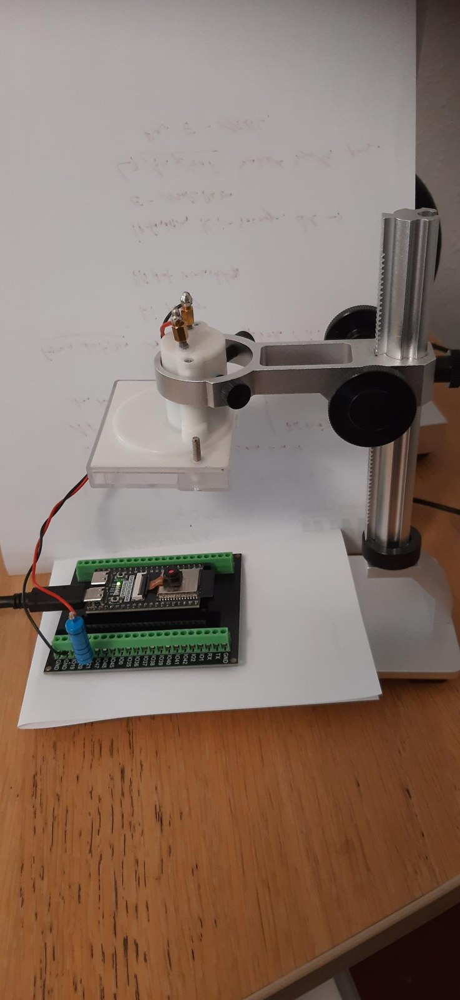
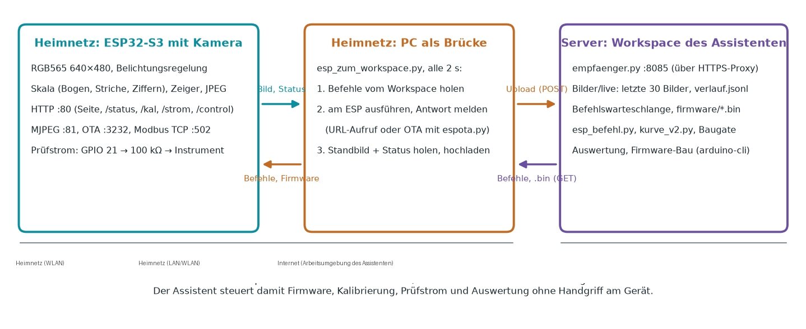
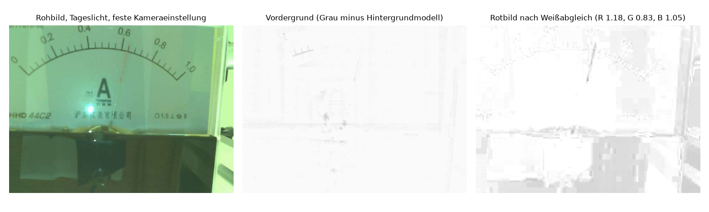
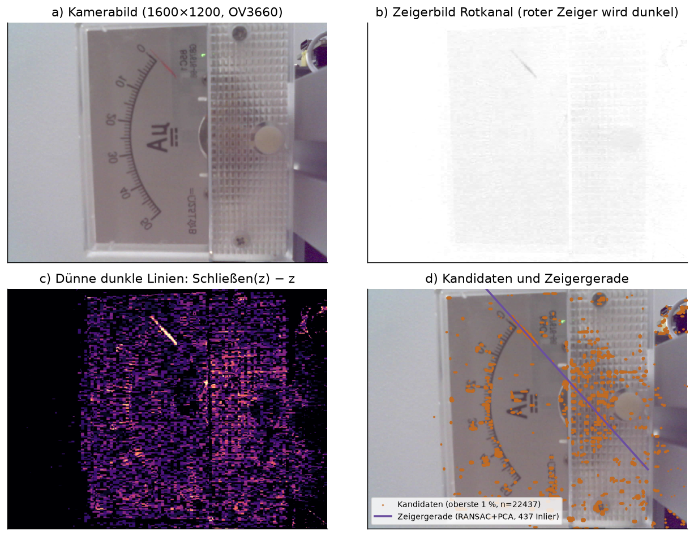
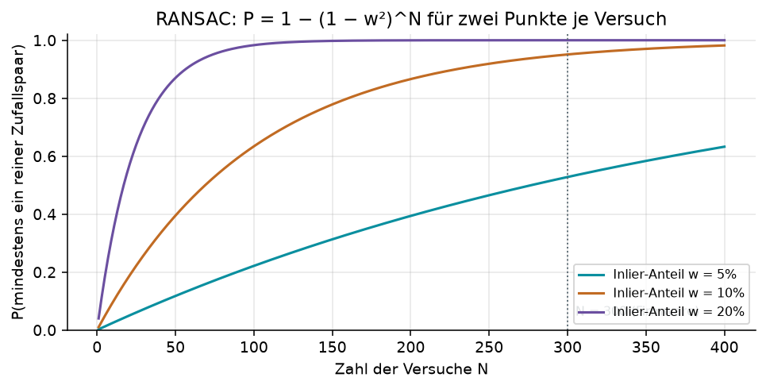
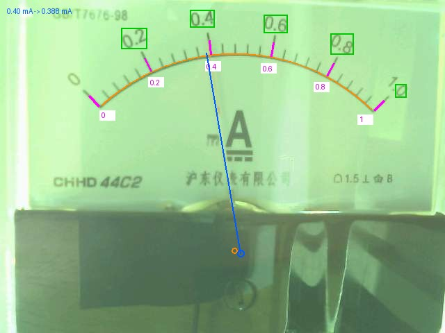
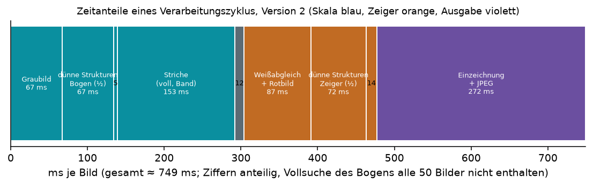
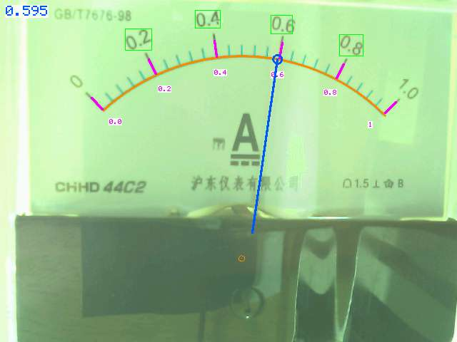
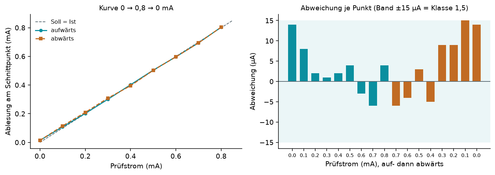
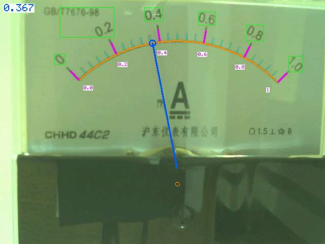

# Aufgabe

Ein analoges Zeigermessgerät für Strom soll ohne Eingriff in das Gerät digital ausgelesen werden. Eine Kamera beobachtet die Skala, ein Mikrocontroller bestimmt aus dem Bild die Zeigerstellung, rechnet sie in den Stromwert um und stellt ihn über das Netz bereit. Die gesamte Bildverarbeitung läuft auf dem Mikrocontroller, also am Ort der Messung (On-Edge), ohne Rechner dahinter.

Als Prüfobjekt dient ein Drehspulinstrument 44C2 mit dem Messbereich 0 bis 1 mA, Klasse 1,5, rotem Zeiger und unterem schwarzem Skalenbogen mit 26 Teilstrichen. Als Rechner dient ein Freenove ESP32-S3 WROOM (N8R8, 8 MB Flash, 8 MB PSRAM) mit aufgestecktem Kameramodul OV3660 (3 Megapixel).

Das Manuskript beschreibt die zweite Version des Verfahrens, die am 16. September 2026 auf Wunsch des Nutzers entstanden ist und die erste vollständig ersetzt hat. Die Reihenfolge ist seine Vorgabe: Zuerst wird die Belichtung so geklärt, dass alle Striche und Ziffern der Skala sauber im Bild stehen. Dann wird die Skala erkannt, der untere Bogen, die Teilstriche, die Hauptstriche und die Zahlen, eindeutig und in jedem Bild neu, und im Bild markiert. Erst dann wird der Zeiger gesucht und dort abgelesen, wo er den Skalenbogen schneidet, so wie ein Mensch die Skala liest. Damit fallen alle Größen weg, die in der ersten Version kalibriert und gespeichert werden mussten: Drehpunkt, Kennlinie aus Prüfströmen, Hintergrundmodell und Verfolgungsmuster. Was bleibt, sind Messbereich und Einheit vom Typenschild.

Daraus folgen fünf Teilfragen, die das Manuskript in dieser Reihenfolge behandelt:

1. Wie stellt man die Kamera so ein, dass Striche und Ziffern zuverlässig eingelesen werden, und wie hält man das im Betrieb?
2. Wie findet man Skalenbogen, Teilstriche, Hauptstriche und Zahlen robust und wie prüft man, dass man sie gefunden hat?
3. Wie liest man den Zeiger ohne Kenntnis des Drehpunkts ab, so dass das Verfahren auch im Einbau arbeitet, wo der Zeiger nicht mehr bewegt werden kann?
4. Wie prüft man das Verfahren, ohne von Hand Ströme einzustellen, und wie gibt man den Wert an eine Leitwarte?
5. Wie lässt sich ein solches Gerät aus der Ferne vollständig in Betrieb nehmen, also Firmware laden, einstellen, prüfen und auswerten, ohne dass jemand am Aufbau Hand anlegt?

Die fünfte Frage ist für die Lehre die interessanteste: Der gesamte Zyklus, vom Übersetzen der Firmware bis zur Kurve mit dem Prüfstrom, wurde vom 11. bis 16. September 2026 von einem KI-Assistenten (Claude Code) aus einer Arbeitsumgebung heraus durchgeführt, die das Heimnetz mit dem Gerät gar nicht erreichen kann. Der Nutzer hat beobachtet, Vorgaben gemacht und zweimal das Instrument verschoben. Wie das geht, beschreibt Kapitel 3. Der Weg über die erste Version, ihre Verfahren und die Gründe, warum sie abgelöst wurde, steht in Kapitel 9.

# Versuchsaufbau

{width=55%}

Das Instrument hängt in einem 3D-gedruckten Adapter im Ring eines Mikroskopstativs, die Skala zeigt nach unten. Die Kamera liegt auf dem Tisch und blickt nach oben, Abstand etwa 12 cm. Die Fixfokus-Linse des Kameramoduls wurde für diesen Abstand um etwa eine Viertelumdrehung herausgedreht (Abbildungsgleichung $1/f = 1/g + 1/b$; bei $f \approx 3{,}6$ mm und $g = 120$ mm beträgt der nötige Auszug $f^2/(g-f) \approx 0{,}11$ mm).

Die Prüfstromquelle ist bewusst einfach: Ein Ausgang des ESP32-S3 (GPIO 21) liefert über den Sigma-Delta-Modulator des Chips eine Pulsdichte zwischen 0 und 100 %, ein Vorwiderstand von 3300 Ω setzt die 3,3 V in Strom um, das Drehspulwerk mittelt die Pulse mechanisch. Der Maximalstrom beträgt

$$ I_{\max} = \frac{3{,}3\,\text{V}}{3300\,\Omega + R_{\text{Instr}}} \approx \frac{3{,}3\,\text{V}}{3720\,\Omega} = 0{,}887\,\text{mA}, $$

wobei der Innenwiderstand des 44C2 von etwa 420 Ω am 13. September aus dem Vergleich von eingestelltem Strom und Skala bestimmt wurde (die Quelle lieferte 9 % weniger als mit $R_{\text{Instr}} = 0$ gerechnet). Der Zeiger schlägt damit bis knapp 0,9 mA aus. Der Prüfstrom dient nur dem Nachweis; das Verfahren der zweiten Version braucht ihn im Betrieb nicht.

Die Beleuchtung kommt seit dem 16. September von Deckenlicht und einer Schreibtischlampe; alle Leuchtdioden der Platine sind abgedeckt, weil eine Lichtquelle neben der Kamera sich im Instrumentenglas spiegelt (Kapitel 9). Eine seitliche LED ist vorgesehen.

# Systemarchitektur und autonome Inbetriebnahme

## Drei Orte, zwei Netze



Das Gerät steht im Heimnetz. Der Assistent arbeitet in einer Arbeitsumgebung auf einem Server in einem anderen Netz; er kann Dateien lesen, Programme übersetzen und Netzdienste anbieten, aber keine Verbindung ins Heimnetz aufbauen. Der PC des Nutzers steht im Heimnetz und kann beides erreichen: das Gerät direkt und den Workspace über dessen öffentliche HTTPS-Adresse.

Daraus ergibt sich die Brücke: Ein Python-Skript auf dem PC (`esp_zum_workspace.py`) läuft in einer Endlosschleife mit zwei Sekunden Takt. Je Durchlauf

1. holt es beim Workspace die anstehenden Befehle ab (`GET /befehle`),
2. führt jeden Befehl am Gerät aus, entweder als Aufruf einer URL des Geräts (etwa `/kal?wert=0`) oder als OTA-Firmwareupdate mit dem Werkzeug `espota.py` aus dem esp32-Kern, und meldet die Antwort zurück (`POST /antwort`),
3. holt ein Standbild und den Statusdatensatz des Geräts und lädt beides in den Workspace (`POST /upload`).

Im Workspace läuft ein kleiner Empfänger (`empfaenger.py`, Port 8085). Er legt die Bilder rollierend ab (die letzten 30 unter `Bilder/live`, dazu `aktuell.jpg` und eine Verlaufsdatei `verlauf.jsonl` mit Winkel, Wert und Lage je Bild), verwaltet die Befehlswarteschlange und liefert Dateien aus (Firmware, `espota.py`). Ein gemeinsamer Schlüssel (Token) schützt alle Zugriffe.

Der Assistent selbst benutzt drei Kommandozeilenwerkzeuge: `esp_befehl.py` reiht einen Befehl ein und wartet auf die Antwort (auch Funk-Update, Modbus-Telegramme, USB-Flash und serielles Mitlesen laufen darüber); `kurve_v2.py` fährt den Prüfstrom in Stufen auf und ab, mit Schreibsperre gegen die Leitwarte, und schreibt Soll, Median, Einzelwert, Zeigerpunkte und Skalenzustand mit; `live_blick.py` tabelliert die letzten Zeilen des Verlaufs und zeigt auf das aktuelle Bild, das der Assistent dann wie jede Bilddatei betrachtet.

## Der autonome Zyklus

Mit dieser Brücke schließt sich ein vollständiger Regelkreis, in dem kein Mensch mehr am Gerät eingreifen muss:

1. Firmware ändern und über das Baugate übersetzen (`firmware_bauen.py ESP32S3_Zeiger_V2`, Kapitel 7); nur eine geprüfte Binärdatei wird unter `firmware/` freigegeben.
2. `esp_befehl.py --ota ESP32S3_Zeiger_V2.bin`: der PC lädt die Firmware und `espota.py` aus dem Workspace, spielt sie über WLAN auf den ESP (Port 3232), der ESP startet neu und bestätigt die neue Fassung nach 90 s störungsfreiem Lauf. Dauer etwa 40 Sekunden.
3. Einstellen: Messbereich und Einheit (`/control?var=bereich&val=1.0`, `einheit=mA`) oder ein einziger bekannter Prüfstrom (`/kal?wert=0.887`), aus dem das Gerät den Bereich mit glatter Rundung bestimmt.
4. Prüfung: `kurve_v2.py 0.1 0.8 8` fährt 0 → 0,8 → 0 mA in Schritten von 0,1 mA mit 8 s Haltezeit und liest je Schritt den vom ESP gemessenen Wert.
5. Auswertung im Workspace: Tabellen, Bildkontrolle der Einzeichnung; bei Auffälligkeiten zurück zu Schritt 1.

Zwischen dem 11. und 16. September wurde dieser Kreis mehr als zwanzigmal durchlaufen. Die Bedienseite des Geräts besteht nur aus HTML, CSS und etwas JavaScript, das den Statusdatensatz abfragt und daraus Zahl, Livebild mit Legende, Kalibrier- und Lichtkarte zeichnet. Alle Handlungen sind URL-Aufrufe derselben Schnittstellen, die auch der Assistent benutzt. Es gibt keine Funktion, die nur die Seite kann.

## Schnittstellen des Geräts

| Pfad | Bedeutung |
|---|---|
| `/` | Bedienseite (Messwert, Livebild mit Einzeichnung und Legende, Kalibrierung, Licht) |
| `/status` | Statusdatensatz (JSON): Skala (Mittelpunkt, Radius, Winkelbereich, Striche, Hauptstriche, Ziffern, Güte), Zeiger (Wert, Median, Winkel, Punkte), Licht, Zeiten je Stufe, Netz, Modbus |
| `/capture` | aktuelles Bild mit Einzeichnung (JPEG 640×480) |
| `:81/stream` | Livebild als MJPEG mit Einzeichnung |
| `/kal?wert=…` | Einpunkt-Bereichsbestimmung aus einem bekannten Prüfstrom; `wert=0` nur Kontrolle |
| `/kal_reset` | Bereich und Einheit löschen |
| `/strom?wert=…` | Prüfstrom in mA setzen (Sigma-Delta, begrenzt auf $I_{\max}$) |
| `/control?var=…&val=…` | `bereich`, `einheit`, `imax`; `aec`, `gain`, `lichtregel`, `regelziel`, `regelledmax`, `led`; `overlay`, `ansicht` (0 Farbe, 1 Rotbild, 2 Graubild), `stream`, `quality`, `hmirror`, `vflip`; `modbusschreiben`, `modbustest`; `sicher`, `neustart` |
| Modbus TCP :502 | Register 0–15 (Kapitel 6) |
| OTA :3232 | Firmwareupdate über WLAN (ArduinoOTA, Hostname `analogcam`) |

# Verfahren

Alle Schritte laufen auf dem ESP32-S3 in dieser Reihenfolge je Bild: Graubild, Skala (Bogen, Striche, Ziffern), Belichtungsmessung und Weißabgleich, Rotbild, Zeigergerade, Schnittpunkt, Wert, Regelung, Einzeichnung, JPEG. Als Referenz existieren gleichlautende Python-Fassungen (`skala_v2.py`, `zeiger_v2.py`), an denen jeder Schritt zuerst am Bildsatz mit bekannten Prüfströmen geprüft wurde; das war eine Forderung des Nutzers vom 13. September und hat sich jedes Mal bezahlt gemacht.

## Belichtung als Messung

Die Kamera ist ein Photometer mit fester Einstellung: Belichtungszeit, Verstärkung und Weißabgleich regelt nicht die Kamera, sondern die Firmware. Welche Einstellung richtig ist, wurde gemessen: ein Raster aus Belichtungszeit (200 bis 1200) und Verstärkung (2 bis 24) ohne LED, je Bild bewertet nach dem Weiß des Zifferblatts (95-%-Wert im Ring um die Skala), dem Schwarz der Striche (5-%-Wert), dem Anteil gesättigter Bildpunkte und der Zahl der auf dem Strichring zählbaren Striche (`belichtungstest.py`, 25 Bilder):

| Verstärkung | Belichtung | Weiß | Schwarz | Sättigung | zählbare Striche |
|---|---|---|---|---|---|
| 2 | 400 … 1200 | 118 … 128 | 76 … 94 | 0 % | 23 … 27 |
| 4 | 1000 … 1200 | 172 | 123 | 0 % | 15 … 22 |
| 8 | 700 … 1200 | 218 … 229 | 153 … 161 | 0 % | 26 … 27 |
| 16 | 400 | 231 | 163 | 0 % | 26 |
| 16 … 24 | ≥ 700 | 250 | 206 … 238 | 4 … 21 % | 8 … 19 |

Verstärkung 8 mit Belichtung 700 bis 1200 legt das Weiß auf 220 bis 230, ohne zu sättigen, und liefert die vollständige Strichzahl. Höhere Verstärkung frisst den Kontrast, weil das Weiß in die Sättigung läuft; niedrigere lässt das Bild dunkel und rauschig. Daraus folgt die Regelgröße: das Weiß des Zifferblatts mit dem Ziel 220 (Totband ±8) und der Nebenbedingung, dass weniger als ein Prozent der Punkte gesättigt ist; Sättigung hat Vorrang. Stellglieder sind in dieser Reihenfolge die LED (heute abgedeckt, Obergrenze 0), die Belichtungszeit 20 bis 1200 und die Verstärkung 2 bis 16. Die Regelung stuft alle drei Bilder und sichert ihren Zustand höchstens einmal je Minute im Flash.

Die erste Fassung der Regelung stufte die Belichtung in festen Schritten von 30, und der Nutzer hat ihre Grenze sofort gefunden: Nach dem Deckenlichtbetrieb (Belichtung 1200, Verstärkung 16) schaltete er die Tischlampe wieder ein, das Weiß stand bei 250 mit 79 % gesättigten Punkten, und die Regelung brauchte 90 Sekunden, um herunterzukommen. „Sollte man die Bildhelligkeit nicht konstant halten können, auch bei sich ändernder Beleuchtung?" Seither regelt sie proportional: Die Belichtung skaliert linear mit der Helligkeit, also wird sie je Schritt mit dem Faktor Ziel/Ist (begrenzt auf 0,6 bis 1,5) multipliziert. Sättigung hat Vorrang und wird schnell abgebaut, zuerst die Verstärkung um zwei Stufen (sie bringt das Rauschen), dann die Belichtung mit dem Faktor 0,7. Im Totband wandert die Verstärkung zur Nennstufe 8 zurück, und die Belichtung gleicht aus. Nachgestellt (Verstärkung 16 und Belichtung 1200 von Hand gesetzt): Sättigung nach fünf Sekunden weg, erster gültiger Wert nach 20 Sekunden, Totband nach 35 Sekunden, ohne einen falschen Wert.

## Rotbild mit rechnerischem Weißabgleich

Die Kamera liefert RGB565 mit 640×480 Bildpunkten. Für die Skala genügt das Graubild $g = (77R + 150G + 29B)/256$. Für den roten Zeiger wird der Rotanteil benutzt,

$$ z = 255 - 255\cdot\frac{\max(R' - \max(G',B'),\,0)}{\max(R', 1)}, $$

allerdings erst nach einem rechnerischen Weißabgleich: Mit festem Kamera-Weißabgleich ist das Bild grünstichig, und der Rotanteil des Zeigers fällt unter null. Die Mittelwerte von R, G und B im Ring 0,55 bis 0,95 des Skalenradius (dort ist das Zifferblatt weiß) liefern drei Faktoren, mit denen das Zifferblatt neutral wird ($R' = R\,\bar w/\bar R$ usw.; am Morgen des 15. September 1,18, 0,83, 1,05). Der Quotient macht das Maß unabhängig von der Helligkeit, und schwarzer Druck, Striche und Ziffern sind farblos: Sie verschwinden im Rotbild von selbst. Der Zeiger hebt sich im Rotbild drei- bis siebenmal deutlicher ab als im Graubild nach Abzug eines Hintergrundmodells; das war am 15. September der Grund, das Hintergrundmodell aufzugeben.



## Dünne dunkle Strukturen

Bogen, Striche und Zeiger sind dünne dunkle Linien; flächige dunkle Bereiche (Gehäuse, Schatten, Beschriftung in Blockschrift) sollen nicht mitzählen. Dafür eignet sich das morphologische Schließen mit einem Fenster, das breiter ist als die Linie: erst Maximumfilter, dann Minimumfilter, beide trennbar in Zeilen und Spalten. Dünne dunkle Strukturen werden dabei aufgefüllt, breite bleiben. Die Differenz

$$ d(x,y) = \big(\text{Schließen}(z)\big)(x,y) - z(x,y) \ge 0 $$

ist genau dort groß, wo etwas Dünnes und Dunkles liegt. Die Firmware rechnet sie dreimal je Bild mit verschiedenen Kernen: für den Bogen auf dem Graubild in halber Auflösung (320×240, 2×2-Mittel, Kern 5, entspricht 9 bis 10 Bildpunkten voller Auflösung), für die Teilstriche auf dem Graubild in voller Auflösung mit Kern 5, aber nur im Zeilenband der Striche (ein Kern von 9 würde die Lücken zwischen den 9 Bildpunkte entfernten Strichen zuschmieren), und für den Zeiger auf dem Rotbild in halber Auflösung. Die halbe Auflösung ist keine Näherung aus Not: Die Kreis- und Geradenschätzungen mitteln über Hunderte von Punkten, und die Rechenzeit sinkt um den Faktor vier, weil die Filter durch den langsamen externen Speicher laufen (Abschnitt 4.9).



## Der Skalenbogen

Der untere Bogen der Skala ist die längste dünne dunkle Linie im Bild. Von den zusammenhängenden Bereichen der Karte $d$ (Schwelle 30 % ihres 99,5-%-Werts, mindestens 15) im oberen Dreiviertel des Bilds wird der größte genommen, der breiter als 30 % des Bilds ist; alles andere, Schrift, Gehäusekante, Zeiger, ist schmaler oder kürzer. Durch bis zu 4000 seiner Punkte wird ein Kreis gelegt, robust und dann genau: 600 Versuche mit je drei zufälligen Punkten (RANSAC, Toleranz 2,5 Bildpunkte wegen der Quantisierung der halben Auflösung, Mittelpunkt unterhalb des Bogens), anschließend zwei Runden algebraischer Ausgleichskreis durch alle Inlier. Für Punkte $(x_i, y_i)$ minimiert er $\sum_i (x_i^2 + y_i^2 + D x_i + E y_i + F)^2$, ein lineares 3×3-System, aus dem Mittelpunkt $(-D/2, -E/2)$ und Radius $\sqrt{D^2/4 + E^2/4 - F}$ folgen. Der Winkelbereich des Bogens (1- und 99-%-Wert der Punktwinkel) begrenzt alle weiteren Suchen.

Ist aus dem Vorbild eine gültige Skala bekannt, geht es schneller: Auf 180 Radialstrahlen im Sektor wird nur ±6 Bildpunkte um den alten Radius nach dem dunkelsten dünnen Punkt gesucht; sind mindestens 80 % der Strahlen belegt, folgt direkt der Ausgleichskreis. Der Bogen wird so in jedem Bild neu vermessen, nicht aus dem Speicher übernommen; alle 50 Bilder läuft ohnehin die volle Suche.

## Teilstriche, Hauptstriche, Zahlen

Auf dem Ring 5 bis 11 Bildpunkte außerhalb des Bogens wird die Dunkelheit $d$ über den Winkel in Schritten von 0,1° aufgetragen (Maximum je Winkel über die Radien), geglättet, und die Spitzen über einer Schwelle (mindestens 10, mindestens 25 % des 99-%-Werts, Sperrabstand 0,6°) sind die Striche. Ihre Länge nach außen, gemessen bis der Grat abreißt, unterscheidet Hauptstriche von Teilstrichen: länger als das 1,5-fache des Medians. Aus den Winkelabständen benachbarter Striche folgen die Teilung (Median) und ihre Regelmäßigkeit (Streuung geteilt durch Teilung). Das 44C2 hat 26 Striche im Abstand von 3,56°, davon 6 Hauptstriche bei 0, 0,2, 0,4, 0,6, 0,8 und 1,0 mA.

Die Zahlen werden nicht gelesen, aber gefunden: Im Ring 32 bis 135 Bildpunkte außerhalb des Bogens (Sektor ±7°) sind sie die dunklen Bereiche (unter 80 % des Weißes) mit der Ausdehnung einer Ziffer (8 bis 45 hoch, 4 bis 60 breit, mindestens 25 Punkte); alle Kästen im Umkreis von 9° um einen Hauptstrich werden zu einem vereint. Weil sich die Kästen von Bild zu Bild nicht ändern, werden sie nur alle zehn Bilder neu bestimmt.


Die Skala gilt in einem Bild als gültig, wenn der Bogen mindestens 200 Inlier hat, die Teilung regelmäßiger als 8 % ist und Strich- und Hauptstrichzahl zur Referenz passen: genau so viele Hauptstriche, höchstens ein Strich Abweichung. Die Referenz lernt das Gerät selbst, sobald 30 Bilder in Folge dieselben Zahlen mit einer Regelmäßigkeit unter 5 % liefern, und speichert sie im Flash; solange keine Referenz bekannt ist, gelten mindestens vier Hauptstriche und zehn Striche. Ein Bild mit mehr als 3 % gesättigten Punkten ist ungültig, gleich was darin erkannt wird. Beide Regeln stammen aus dem Lampentest: Solange die Referenz fehlte, hatte während der Sättigung eine halbe Skala mit 10 Strichen und 2 Hauptstrichen als gültig gegolten, einmal mit einem Wert von 0,993 mA. Eine Güte (Anteil der Striche auf dem regelmäßigen Raster) steht im Status und im Modbus-Register 6. Die Einzeichnung, die der Nutzer für jedes Bild verlangt hatte, ist zugleich die Selbstkontrolle: Sitzt der orange Bogen auf dem schwarzen, stehen die cyanfarbenen Marken auf den Strichen, dann ist die Skala verstanden.

Offline, an 76 Bildern der letzten drei Tage, kamen 46 exakt auf 26 Striche und 6 Hauptstriche; die übrigen waren gesättigte und unterbelichtete Bilder des Belichtungsversuchs, genau die, die Abschnitt 4.1 aussortiert. Auf dem Gerät stand die Skala unter Decken- und Tischlicht in jedem Bild mit 26/6 und Güte 1,0.

## Die Zeigergerade

Die Zeigersuche läuft im Rotbild (halbe Auflösung) nur im Sektor der Skala zwischen 30 % des Radius und dem Bogen. Kandidaten sind die dünnen dunklen Punkte über dem 98,5-%-Wert der Karte (mindestens 12), höchstens 3000. Aus dieser Kandidatenwolke wird die Gerade mit den meisten Punkten gesucht.

Aus der Kandidatenwolke wird die Gerade mit den meisten Punkten gesucht (RANSAC): Wiederholt werden zwei zufällige Kandidaten gezogen, die Gerade durch sie gelegt und gezählt, wie viele Kandidaten näher als $\tau = 3$ (halbe Auflösung) Bildpunkte an ihr liegen. Für die Gerade durch $p_i$ mit Richtung $\vec d$ ist der Abstand eines Punktes $q$

$$ \operatorname{dist}(q) = \frac{|(q - p_i)\times \vec d|}{|\vec d|}, $$

was in der Firmware ohne Wurzel als $((q-p_i)\times\vec d)^2 < \tau^2 |\vec d|^2$ geprüft wird.

Wie viele Versuche braucht man? Ist $w$ der Anteil der Kandidaten, die zum Zeiger gehören, so ist ein Paar mit Wahrscheinlichkeit $w^2$ rein, und die Wahrscheinlichkeit, in $N$ Versuchen mindestens ein reines Paar zu ziehen, beträgt

$$ P = 1 - (1 - w^2)^N. $$

Bei $w = 0{,}10$ und $N = 300$ ist $P = 0{,}95$; bei $w = 0{,}20$ schon nach 75 Versuchen. Am Kamerabild lag $w$ zwischen 0,02 und 0,1, je nach Zeigerstellung. Die Firmware benutzt $N = 500$; das reicht, weil der Zeiger selbst bei kleinem $w$ die mit Abstand größte kollineare Punktmenge ist und die anschließende Verfeinerung Ungenauigkeiten des Startpaars ausgleicht.

{width=70%}

Die Verfeinerung geschieht in zwei Runden. Zuerst wird aus den Inliern die Hauptachse bestimmt: Für Punkte mit Schwerpunkt $(\bar x, \bar y)$ und Kovarianzen $s_{xx}, s_{xy}, s_{yy}$ ist die Richtung des größten Eigenwerts der 2×2-Kovarianzmatrix

$$ \vartheta = \tfrac12\,\operatorname{atan2}\big(2 s_{xy},\; s_{xx} - s_{yy}\big), \qquad \vec d = (\cos\vartheta, \sin\vartheta). $$

Das ist die Gerade, die die Summe der quadrierten Abstände minimiert (Hauptkomponentenanalyse). Dann werden die Inlier auf die Gerade projiziert und sortiert; nur der längste zusammenhängende Abschnitt ohne Lücke über 12 Bildpunkte bleibt. Damit fallen entfernte Störpunkte heraus, die zufällig auf der Geraden liegen (am Kamerabild etwa rötliche Punkte am Bildrand, die die Gerade ohne diesen Schritt um 6° verdrehten).

Die Gerade erhält ihre Richtung vom Skaleninneren nach außen; sie wird als blaue Linie ins Livebild gezeichnet, vom inneren Ende der Kandidaten bis zum Schnittpunkt mit dem Bogen. Ein Zeiger gilt als gefunden, wenn mindestens 40 Punkte auf der Geraden liegen; diese Zahl steht als „Sicherheit" im Status und im Modbus-Register 5.

## Ablesung am Schnittpunkt: kein Drehpunkt

Die erste Fassung des Zeigerschritts nahm den Bogenmittelpunkt als Drehpunkt und korrigierte die Parallaxe (Zeiger und Skala liegen in verschiedenen Ebenen) durch einen kalibrierten Versatz von etwa 3 % des Radius. Der Nutzer wandte ein, was im Einbau gilt: „Später kann das Instrument nur erfasst werden, der Zeiger aber nicht mehr manipuliert." Kein Prüfstrom, keine Zweipunktkalibrierung, kein Drehpunkt. Und er gab die Lösung mit: „Man kennt ja den Bogen der Skala und die Skalenstriche, also setzt man einen Punkt, wo der Zeiger den Skalenbogen schneidet, und liest dort ab. Dann braucht man keinen Drehpunkt."

Genau so liest ein Mensch die Skala. Für die Gerade $p + t\,\vec d$ und den Kreis um $c$ mit Radius $r$ löst

$$ |p + t\,\vec d - c|^2 = r^2 $$

eine quadratische Gleichung in $t$; die Lösung in Zeigerrichtung ist der Schnittpunkt $s$, und der Winkel $\varphi = \operatorname{atan2}\big(-(s_y - c_y),\, s_x - c_x\big)$ vom Bogenmittelpunkt ist die Ablesung in Winkelmaß. Zwischen den Winkeln der Hauptstriche $\varphi_k$, denen die Werte $W\,k/(n-1)$ mit dem Messbereich $W$ zugeordnet sind, wird stückweise linear interpoliert, außerhalb linear verlängert. Der Drehpunkt kommt nicht vor. Die Parallaxe hebt sich auf, weil Zeiger und Ablesestelle an derselben Stelle des Bilds betrachtet werden. Ein Hintergrundmodell braucht es nicht, weil die Skala in jedem Bild neu vermessen wird. Und weil Bogen, Striche und Zeiger im selben Bild stehen, ist jede Verschiebung, Verdrehung oder Abstandsänderung des Instruments nur eine andere Lage der Skala, solange der Bogen im Bild bleibt.

Was bleibt, sind Messbereich $W$ und Einheit vom Typenschild. Steht ein Prüfstrom zur Verfügung, genügt ein einziger bekannter Wert $I$: Aus seinem Anteil $a$ am Skalenweg folgt $W = I/a$, gerundet auf den nächsten glatten Wert (1, 1,5, 2, 2,5, 3, 5 mal Zehnerpotenz); mit 0,887 mA ergab das 1,0 mA. Angezeigt wird der Median der letzten fünf gültigen Werte.



Offline ergab die Schnittpunktmethode am Bildsatz 0 bis 0,85 mA eine größte Abweichung von 0,011 mA und im Mittel 0,004 mA, ohne jede Kalibrierung außer dem Messbereich.

## Gültigkeit

Ein Wert gilt nur, wenn zwei Bedingungen in demselben Bild erfüllt sind: Die Skala ist gültig (Abschnitt 4.5), und der Zeiger ist gefunden (Abschnitt 4.6). Sonst meldet das Gerät „unsicher", hält im Modbus-Register den letzten gültigen Wert und setzt die Gültigkeit auf 0. Der nächtliche Fehler der ersten Version, eine falsch sitzende Geometrie mit dem Vermerk „gültig", ist damit ausgeschlossen: Eine falsch sitzende Geometrie erkennt keine 26 regelmäßigen Striche.

## Prüfstromquelle

Die Prüfstromquelle macht das Gerät zum Prüfstand seiner selbst, auch wenn das Verfahren sie nicht braucht. Der Sigma-Delta-Modulator des ESP32-S3 liefert eine Pulsdichte mit 256 Stufen bei etwa 312 kHz; das Drehspulwerk mittelt. Der Sollwert kommt über `/strom`, über die Modbus-Register 8/9 (Float) oder 15 (Mikroampere, ganzzahlig) und wird auf $I_{\max}$ begrenzt. Eine Schreibsperre (`modbusschreiben`, automatisch während einer Bereichsbestimmung) hält die Leitwarte fern, die den Sollwert sonst jede Sekunde überschreibt.

Ein Detail hat einen Nachmittag gekostet: Die naheliegende PWM-Einheit (LEDC) ließ sich nicht neben der Kamera betreiben. Der Kameratreiber erzeugt den 20-MHz-Pixeltakt mit LEDC-Kanal 0 und Timer 0; ein weiterer LEDC-Timer mit anderer Frequenz kam nicht zustande, obwohl der Aufruf keinen Fehler meldete. Der Zeiger blieb auf null. Erst der Test mit festem Pegel am Pin (Zeiger schlägt aus) grenzte den Fehler ein. Der Sigma-Delta-Modulator ist von LEDC unabhängig; als zweite, umschaltbare Erzeugungsart dient jetzt LEDC auf Kanal 6 mit Timer 3, das nach der Kamera-Initialisierung eingerichtet wird und ebenfalls funktioniert.

## Zeitverhalten

Ein Bild dauert 0,87 bis 0,89 s. Die Stufen, gemessen auf dem Gerät (Millisekunden): Graubild 67, dünne Strukturen für den Bogen 67 (halbe Auflösung), Bogenprüfung 5, Striche 153 (volle Auflösung im Band), Ziffern 0 bis 120 (alle zehn Bilder), Weißabgleich und Rotbild 87, dünne Strukturen für den Zeiger 72, Kandidaten 11, RANSAC 3, Einzeichnung und JPEG 272. Vor der Verlegung von Bogen und Zeiger auf die halbe Auflösung waren es 1,81 s, davon über eine Sekunde in den drei Schließfiltern: Der ESP32-S3 rechnet die Filter schnell genug, aber die Bilder liegen im externen PSRAM, dessen Bandbreite die Grenze ist. Der freie Heap liegt bei 88 kB und ändert sich nicht.

{width=85%}

# Ergebnisse am Gerät

Die zweite Firmware ist modular geschrieben (zehn Dateien: Licht, Bild, Skala, Zeiger, Kalibrierung, Strom, Netz, Modbus, Schutz, Bildtakt), übernimmt aus der ersten die Kamera, den Weißabgleich, das Netz mit dem Sockelbudget, Modbus TCP und den Selbstschutz, und verwirft Hintergrundmodell, Verfolgungsmuster, Drehpunkt und Ausrichtungssuche. Der erste Lauf auf dem Gerät meldete „Skala FEHLT", und der Nutzer sah es zuerst: „Dein Livebild ist wohl gespiegelt?" Die zweite Firmware hat einen eigenen Einstellungsspeicher, in dem die Bildausrichtung noch nicht gesetzt war. Ein Befehl später stand die Skala: 26 Striche, 6 Hauptstriche, Güte 1,0.



Der Nachweis mit dem Prüfstrom, Schreibsperre gegen die Leitwarte, Deckenlicht und Tischlampe, ohne LED, ohne jede Kalibrierung außer „Bereich 1,0 mA" (`kurve_v2.py`, Haltezeit 8 s):

| Soll (mA) | 0,00 | 0,10 | 0,20 | 0,30 | 0,40 | 0,50 | 0,60 | 0,70 | 0,80 |
|---|---|---|---|---|---|---|---|---|---|
| aufwärts | 0,014 | 0,108 | 0,202 | 0,301 | 0,402 | 0,504 | 0,597 | 0,694 | 0,804 |
| abwärts | 0,014 | 0,115 | 0,209 | 0,309 | 0,395 | 0,503 | 0,596 | 0,694 | – |

{width=80%}

Alle 17 Punkte gültig, in jedem Bild 26 Striche und 6 Hauptstriche, 73 bis 96 Zeigerpunkte, größte Abweichung 0,015 mA, im Mittel 0,006 mA, keine Hysterese. Die konstanten +0,014 am Nullpunkt sind die mechanische Nulllage des Instruments; die erste Version las dort +0,012. Die Abweichung entspricht der Klasse 1,5 des Instruments (±0,015 mA) und der Unsicherheit des Prüfstroms. Die zweite Version erreicht damit die Genauigkeit der ersten (0,010 bis 0,013 mA unter verschiedenen Lichtern) ohne deren Kalibrierapparat, und sie kann es im Einbau, wo niemand einen Prüfstrom einspeist. Dass sie auch Verschiebung und Lichtwechsel ohne Vorkehrung übersteht, zeigten zwei Eingriffe des Nutzers unmittelbar danach.

Der Verschiebetest folgte auf die Frage des Nutzers, ob die zweite Version auch stabiler sei, wenn sich das Messgerät verschiebt („habe es bewegt"): Er verschob und verdrehte das Instrument um einige Grad. Ohne Eingriff, ohne Suche, ohne Neukalibrierung stand die Skala in jedem folgenden Bild mit 26 Strichen und 6 Hauptstrichen, Güte 1,0, und die Ablesung 0,367 mA bei einer Vorgabe von 0,36 aus Trendows. Während der Bewegung selbst zählte das Gerät 82 ungültige Bilder und gab keinen falschen Wert aus. Was in der ersten Version einen Verlust, eine Suche von 37 Sekunden und zweimal eine blinde Fehlmessung bedeutet hatte, ist in der zweiten Version kein Ereignis mehr.



Der Lampentest folgte unmittelbar („ich habe jetzt mal das Schreibtischlicht ausgeschaltet"): Nur noch Deckenlicht, keine LED. Die Regelung führte das Weiß des Zifferblatts nach, zuerst mit der Belichtungszeit bis an den Anschlag 1200, dann mit der Verstärkung von 8 auf 13; das Weiß blieb bei 215 bis 220, die Sättigung bei null, die Skala in jedem Bild bei 26/6 mit allen sechs Zahlen, kein Bild ungültig, die Werte 0,304, 0,670 und 0,795 mA bei Vorgaben von 0,3, 0,672 und 0,8. Der Rückweg, Lampe wieder an, deckte dann die zwei Schwächen auf, die Abschnitt 4.1 und 4.5 beschreiben: die zu langsame Schrittregelung und die zu laxe Gültigkeit ohne Referenz-Strichzahl. Beide sind seit mittags behoben und nachgestellt. Noch offen ist der Dauerlauf über Nacht.

# Anbindung: Modbus TCP und Trendows

Der Nutzer hatte am 13. September nach der Übergabe an Trendows gefragt. Die Firmware bietet einen Modbus-TCP-Server auf Port 502 mit Geräteadresse 1 in einem eigenen Task, damit die Antwortzeit nicht am Bildtakt hängt. Gelesen wird mit Funktionscode 3 oder 4; Funktionscode 16 ist für die Register 8 und 9 (Prüfstrom als Float) und Register 15 zugelassen, Funktionscode 6 für Register 15. Fließkommazahlen belegen zwei Register, High-Word zuerst, wie bei den ADAM-Modulen der anderen Projekte.

| Register | Inhalt | Format |
|---|---|---|
| 0–1 | Messwert (letzter gültiger Median) | Float |
| 2–3 | Zeigerwinkel am Schnittpunkt in Grad | Float |
| 4 | Gültigkeit (Skala und Zeiger in diesem Bild) | 0/1 |
| 5 | Sicherheit = Zeigerpunkte auf der Geraden | ganzzahlig |
| 6 | Skalengüte × 100 | 0–100 |
| 7 | Bildzähler | 16 Bit |
| 8–9 | Prüfstrom (lesen und schreiben) | Float |
| 10 | Bilddauer in ms | ganzzahlig |
| 11 | Weiß des Zifferblatts (Regelgröße) | 0–255 |
| 12 | LED-Stufe | 0–255 |
| 13 | Messbereich gesetzt | 0/1 |
| 14 | Skala in diesem Bild gültig | 0/1 |
| 15 | Prüfstrom in µA, ganzzahlig (lesen und schreiben, FC6 oder FC16) | 0–887 |

Geprüft wurde zunächst auf dem Gerät selbst: Ein Selbsttest (`/control?var=modbustest&val=1`) verbindet sich über die Schleifenschnittstelle 127.0.0.1 mit dem eigenen Server, liest die Register und deutet sie; die eigene WLAN-Adresse nimmt der TCP-Stapel dafür nicht an. Für die Prüfung aus dem Heimnetz hat die PC-Brücke einen Befehlstyp `modbus` erhalten, mit dem der Assistent Register lesen und den Prüfstrom setzen kann; `modbus_test.py` tut dasselbe von Hand. In Trendows ist das Gerät als Element „Lan-IO" einzutragen (IP des ESP, Port 502, Wartezeit 100 ms, Modul-Typ Modbus, normale Word-Order); die Klammerzahl hinter dem Kanaltyp ist der Funktionscode:

| Nr. | Typ | Anzahl | Adress-Offset | Modul-Adresse | Bedeutung |
|---|---|---|---|---|---|
| 1 | AI (3) | 1 | 0 | 1 | Messwert in mA (Float, Register 0–1) |
| 2 | WI (3) | 4 | 4 | 1 | Gültigkeit, Zeigerpunkte, Skalengüte in %, Bildzähler |
| 3 | WO (16) | 1 | 15 | 1 | Prüfstrom-Sollwert in µA, ganzzahlig (schließt den Regelkreis) |
| 4 | WI (3) | 1 | 14 | 1 | Skala gültig (0/1), empfohlen |

Was in den Kanälen steht, mit Wertebereich:

| Zeile | Kanal | Inhalt | Wertebereich |
|---|---|---|---|
| 1 (AI) | 1 | Messwert des Instruments | 0 bis 1 mA als Float; bei „unsicher" bleibt der letzte gültige Wert stehen |
| 2 (WI) | 1 | Gültigkeit des Messwerts | 0 unsicher, 1 gültig |
| 2 (WI) | 2 | Zeigerpunkte auf der Geraden | 40 bis etwa 100; unter 40 kein Zeiger |
| 2 (WI) | 3 | Skalengüte | 0 bis 100 % |
| 2 (WI) | 4 | Bildzähler | 0 bis 65535, läuft über; steht er, steht die Bildverarbeitung |
| 3 (WO) | 1 | Prüfstrom-Sollwert (Eingabe) | 0 bis 887 µA, ganzzahlig |

Der Regelkreis Leitwarte → Prüfstrom → Instrument → Kamera → Messwert → Leitwarte ist seit dem 14. September geschlossen und lief mit der ersten Version über Nacht mit 170 000 Anfragen ohne Fehler; mit der zweiten Version gab Trendows während des Nachweises die Sollwerte 0,6 und 0,4 mA vor und las 0,595 und 0,395 zurück. Die Anzeige des Kamerabilds in Trendows ist offen; dafür braucht es das Trendows-Element für ein Bild aus einer URL, dessen Namen der Nutzer noch nachsieht.

## Fehlersuche an der Leitwarte, Schritt für Schritt

Die erste Stunde mit Trendows ist ein Lehrstück dafür, wie man ein Gerät aus der Ferne an eine Leitwarte bringt, ohne die Leitwarte selbst zu sehen. Der Assistent hatte drei Werkzeuge: den Statusdatensatz des ESP mit den Modbus-Zählern (Anfragen, Fehler, zuletzt bedienter Funktionscode und Registerbereich), die Möglichkeit, die Firmware in drei Minuten um eine Diagnose zu erweitern und per Funk aufzuspielen, und die Brücke auf dem PC, die jedes Modbus-Telegramm selbst senden kann. Der Nutzer hatte den Bildschirm von Trendows und meldete, was er sah. Die Schritte:

1. **„Keine Verbindung, roter Pfeil bleibt."** Der erste Blick ging nicht auf Trendows, sondern auf die Zähler des ESP: 211 Anfragen, 70 Fehler, zuletzt Funktionscode 3 auf die Register 4 bis 7, also die zweite Zeile der Kanaltabelle. Damit war die Netzfrage beantwortet: Trendows erreicht den ESP, die Telegramme werden verstanden, jede dritte Anfrage endet mit einer Fehlerantwort. Ein Drittel passt zu drei Zeilen in der Kanaltabelle: eine davon scheitert immer. Die zweite Meldung des Nutzers, „kein Trigger für Speicherung", war als Warnung der Datenaufzeichnung erkennbar und mit der Verbindung nicht verwandt.

2. **Diagnose nachrüsten statt raten.** Welche Zeile scheitert und warum, verriet der Zähler nicht. Die Firmware erhielt in der Fehlerantwort eine Klartextzeile mit Funktionscode, Ausnahmecode, Telegrammlänge, Adresse, Registerzahl und, bei Schreibbefehlen, dem empfangenen Wert samt Rohwörtern; dazu getrennte Zähler für abgewiesene Verbindungen und unplausible Köpfe. Übersetzt über das Baugate, per Funk aufgespielt, nach zwei Minuten stand im Status:

   ```
   FC16 Wert 102 unzulaessig (Woerter 42CC 0000)
   ```

   Das sagte alles auf einmal. Trendows schreibt den Ausgang der dritten Zeile in jedem Zyklus (Funktionscode 16), der Wert ist 102,0 mA, weit über dem zulässigen Maximum von 0,887 mA, der ESP antwortet mit Ausnahme 3, und Trendows wertet die Fehlerantwort als Störung. Die Rohwörter 0x42CC 0x0000 bestätigten nebenbei die Word-Order: 0x42CC0000 ist 102,0 als IEEE-Float mit dem High-Word zuerst, Trendows „normal" entspricht also der Konvention des ESP. Der Nutzer fand die Quelle: ein Eingabeelement mit dem Wert 102.

3. **Das Gerät tolerant machen.** Eine Leitwarte, die Ausgänge zyklisch schreibt, darf nicht mit jeder Abweichung eine Störung auslösen. Der ESP nimmt seither unzulässige Sollwerte an, verwirft sie, zählt sie und behält den letzten im Klartext („FC16 Wert 127.5 verworfen (zulaessig 0..0.887)"). Nach dem Update: 762 Anfragen, 0 Fehler, der Pfeil in Trendows grün. Das Problem war damit noch nicht gelöst, aber sichtbar geworden: Der Nutzer hatte inzwischen 127,5 eingestellt, weil das Eingabeelement Stufen wie beim alten ESP32-Baustein nahelegte, und der ESP verwarf auch das.

4. **Der Einwand des Nutzers ändert die Schnittstelle.** „Wir können doch nur ganze Zahlen verwenden." Das Eingabeelement liefert keine Fließkommazahlen. Also bekam die Firmware ein sechzehntes Register: Prüfstrom in Mikroampere, ganzzahlig 0 bis 887, schreibbar mit Funktionscode 6 und 16. Die Brücke lernte, dieses Register zu beschreiben, aktualisierte sich selbst im laufenden Prozess, und der Assistent prüfte den Weg: 400 hinein, 0,395 mA im Messwertregister zurück. Die Kanaltabelle in Trendows wurde auf WO (16), Offset 15 geändert.

5. **Ein eigener Fehler, sofort sichtbar.** Trendows verband sich wieder, der Pfeil blieb rot. Die Diagnose: „FC16 Code 2: 15 Byte, adr 15 anz 1". Trendows schrieb korrekt ein Register an Adresse 15, das Telegramm war 15 Byte lang, sieben für den Kopf, eins für den Funktionscode, je zwei für Adresse und Registerzahl, eins für die Bytezahl, zwei für den Wert. Die Firmware verlangte für diesen Fall aber mindestens 17 Byte, den Wert des Zwei-Register-Telegramms, aus dem die Prüfung übernommen worden war, und fiel deshalb in den Zweig für das Float-Register, wo Adresse 15 unzulässig ist. Eine Zahl geändert, aufgespielt; die Brücke erhielt einen Befehl, der Trendows' Telegramm Byte für Byte nachspielt, und bestätigte: Register 15 geschrieben, Prüfstrom 0,255 mA, Messwert folgt.

6. **Der geschlossene Kreis.** Trendows verband sich nach diesem Update von selbst wieder. Der Nutzer stellte im Eingabeelement Werte ein, der Assistent las am ESP mit: Vorgabe 201 µA, Prüfstrom 0,201 mA, Messwert 0,200 mA; Vorgabe 138 µA, Prüfstrom 0,140 mA, Messwert 0,143 mA, Sicherheit 57 bis 82. Über 2000 Anfragen ohne Fehler bei rund 18 Anfragen je Sekunde. Der Nutzer: „Jetzt übernimmt er den Teststrom."


Drei Regeln bleiben aus dieser Stunde. Erstens: Zähler im Gerät sind wertvoller als jede Vermutung über die Gegenseite; „verbunden, aber Fehler" und „nicht verbunden" sehen auf dem Bildschirm der Leitwarte gleich aus und sind im Gerät sofort zu unterscheiden. Zweitens: Der letzte abgewiesene Befehl im Klartext, mit Rohbytes, ersetzt einen Protokollanalysator. Drittens: Ein Update trennt die Leitwarte; wer die Verbindung nicht selbst wieder aufbaut, muss neu aktivieren. Trendows hat das beim zweiten Mal von sich aus getan, beim ersten nicht.

Aus dem Heimnetz bestätigte die Brücke: 15 Register in 64 ms, Werte deckungsgleich mit dem Statusdatensatz; ein Schreibbefehl auf die Register 8 und 9 setzte den Prüfstrom auf 0,400 mA, und sechs Sekunden später stand 0,396 mA im Messwertregister. Der Regelkreis Leitwarte → Prüfstrom → Instrument → Kamera → Messwert → Leitwarte ist damit geschlossen.

# Betrieb und Absicherung

## Ein Absturz und seine Folgen: Baugate und Selbstschutz

Während der Nutzer die Abdeckung anbrachte, wurde das Gerät unerreichbar. Die serielle Ausgabe zeigte nach dem Reset einen Absturz „LoadProhibited" im Statusaufruf. Die Ursache war eine einzige Zeile: In die Statuszeile waren neue Argumente für die Regelung eingefügt worden, die zugehörigen Platzhalter im Formatstring aber nicht. Jede Abfrage von `/status` startete den Chip neu, die Bedienseite ging nur sporadisch, die Brücke brach ab, ein Funk-Update war unmöglich. Der Nutzer musste per Kabel neu programmieren und forderte: „Bitte etwas einbauen, das in Zukunft verhindert, dass ein neues Stück Code die Toolchain zum Absturz bringt."

Die Antwort hat zwei Ebenen. Auf dem Rechner ein Baugate (`firmware_bauen.py`): Es prüft statisch jeden `snprintf`- und `printf`-Aufruf der Firmware (Zahl der Platzhalter gegen Zahl der Argumente, auch über mehrere Zeilen), übersetzt mit allen Warnungen und wertet Formatfehler, fehlende Rückgaben, uninitialisierte Variablen und Reihenfolgefehler als Fehler; erst dann wird die Binärdatei zur Funk-Update-Quelle kopiert. Beim ersten Lauf fand es sofort zwei weitere Formatfehler. Auf dem Gerät ein Selbstschutz: Nach einem Funk-Update bestätigt sich die Firmware erst nach 90 s störungsfreiem Lauf, sonst startet der Bootloader die vorige Fassung; ein Absturzzähler im nichtflüchtigen Speicher schaltet nach drei Abstürzen in Folge in einen Sicherheitsmodus mit WLAN, OTA und Status, ohne Kamera und Bildverarbeitung; ein Watchdog von 120 s fängt Hänger. Beide Funk-Updates des Abends liefen darüber ohne Rückfall.

Die Lehre ist allgemeiner als der Fehler: Jede automatische Ersetzung im Quelltext braucht eine Prüfung, dass sie genau einmal trifft; jede Formatzeile ist ein Vertrag zwischen zwei Stellen; und ein Gerät im Feld braucht einen Weg zurück, der nicht vom fehlerhaften Code abhängt.

Das Baugate hat seit dem 15. September eine zweite Prüfung: Zeilenkommentare, die mit einer Anweisung enden. Zweimal hatte eine automatische Ersetzung, deren Text mit einem Kommentar endete, die nachfolgende Anweisung derselben Zeile in den Kommentar gezogen, einmal die Deklaration eines Puffers, einmal das Zurücksetzen einer Suche, die dadurch nie endete. Beides übersetzte fehlerfrei. Eine dritte Regel gilt für die Befehlskette: `bauen | tail && ota` spielt bei einem Baufehler das alte Binary auf, weil `tail` den Fehler verschluckt; geprüft wird auf das Wort „freigegeben".

## Das Sockelbudget

Zur Netzsperre: Mehrmals an diesem Tag lief das Gerät weiter, las richtig und wies doch jede Verbindung mit einem TCP-Reset ab. Die Brücke hat dafür gelernt, die serielle Ausgabe mitzulesen und den ESP über die Leitung neu zu starten, ohne dass jemand am Aufbau steht; und die Firmware meldet seither alle zehn Sekunden freien Speicher und einen Probe-Sockel. Die Probe lieferte am späten Nachmittag den Beweis: „Sockel-Probe ERSCHÖPFT". Der Netzwerkstapel des ESP hat 16 Verbindungsplätze; Webserver und Stream durften je sieben belegen, Modbus vier, dazu Listener, OTA und Namensdienst, zusammen bis zu 26. Seit Modbus dazugekommen war, lief das Fass immer dann über, wenn Brücke, Leitwarte und Befehlsketten zusammenkamen; Modbus selbst lief in eigenen Plätzen weiter, was die Sperre so rätselhaft machte. Mit festen Obergrenzen (Webserver drei, Stream zwei, Modbus zwei) bleibt die Summe unter 16. Die Lehre für jedes vernetzte Gerät mit mehreren Diensten: Der Sockelvorrat ist ein gemeinsames Budget, und ein Probe-Sockel in der Diagnose zeigt in einer Zeile, ob es aufgebraucht ist.

Dazu gehört die Verdrängung hängender Verbindungen: Nach einem abgebrochenen Bildabruf hatten am 14. September hängende Verbindungen des alten Brückenprozesses alle Plätze des HTTP-Servers belegt, der Bildzähler lief weiter, aber jede neue Verbindung erhielt einen TCP-Reset. Der Server verdrängt seither die älteste Verbindung, wenn eine neue kommt (`lru_purge_enable`), und die Firmware meldet alle zehn Sekunden freien Speicher, größten Block und den Zustand eines Probe-Sockels auf der seriellen Schnittstelle.

## Die Brücke als verlängerter Arm

Zwei Fragen des Nutzers am Abend („Kannst du das Python-Programm nicht selbst starten?" und „Kannst du nicht selbst über USB programmieren?") haben eine klare Antwort: nein, denn beides liegt auf seinem PC, den der Assistent nicht erreicht. Die Brücke aber läuft auf genau diesem PC. Sie hat deshalb drei Fähigkeiten erhalten: Sie liest und schreibt Modbus-Register, sie holt auf Befehl ihre eigene neue Fassung aus dem Workspace und ersetzt ihre Funktionen im laufenden Prozess (kein Neustart, die Entwicklungsumgebung bleibt verbunden), und sie schreibt die Firmware mit dem esptool des PCs über das USB-Kabel, wenn ein Funk-Update unmöglich ist, wie am Nachmittag nach dem Absturz. Der Nutzer muss das Skript seither nur noch einmal starten.

Der erste USB-Versuch scheiterte lehrreich: Der serielle Anschluss war vom Monitor der Entwicklungsumgebung belegt. Ein Kabel hat immer nur einen Herrn. Nach dem Schließen des Monitors lief der Weg durch: Firmware aus dem Workspace, Prüfsumme, OTA-Verwaltungsdaten gelöscht, App geschrieben und verifiziert, Reset über die RTS-Leitung, 18 Sekunden vom Befehl bis zur Antwort; zwölf Sekunden später war das Gerät mit Kalibrierung und Hintergrundmodell wieder im Netz. Damit führen drei Wege ohne Nutzer zum Gerät: Funk-Update, Kabel über die Brücke und der Sicherheitsmodus.

Seit dem 15. September liest die Brücke auf Befehl auch die serielle Ausgabe des Geräts mit und startet den ESP über die Leitungen der USB-Buchse neu; das war der Weg, auf dem die Sockelerschöpfung nachgewiesen wurde, während das Netz gesperrt war.

# Der Weg dahin: Version 1 und ihre Ablösung

Die erste Version entstand vom 11. bis 15. September und hat das Gerät vier Tage lang gelesen. Ihre Verfahren sind hier zusammengefasst, weil aus ihnen die zweite Version hervorgegangen ist und weil ihre Fehler lehrreich sind; die vollständige Fassung steht im Archiv (`Manuskript/Archiv/`).

## Verfahren der ersten Version

Der Zeiger wurde wie heute als Gerade in den dünnen dunklen Strukturen gefunden. Der Drehpunkt kam aus der Selbstkalibrierung: Zwei Ausschläge mit bekanntem Prüfstrom, die Geraden schneiden sich im Drehpunkt, der Winkel je Ausschlag wird zur Marke der Kennlinie. Gemessen wurde im Betrieb über ein Polarprofil um den Drehpunkt (Helligkeit entlang eines Radiusbands über dem Winkel, Tal mit Parabelscheitel), die Sicherheit war die Taltiefe geteilt durch die Streuung. Gegen Spiegelung der Platine im Glas und gegen Beschriftung diente ein Hintergrundmodell (Maximum der Kalibrierbilder, zeigerfrei), das im Betrieb nachgeführt und im Flash gehalten wurde. Gegen Verschieben und Verdrehen des Instruments diente eine Verfolgung: Korrelation eines gespeicherten Musters des Strichrings mit dem Bild, dazu eine weite Suche über Lage, Maßstab und Drehung, die nach dem Verlust der Verfolgung in etwa 37 Sekunden die Skala wiederfand. Die Kennlinie wurde am 13. September von den Prüfströmen auf die Hauptstriche der Skala umgestellt, die ein Skript aus dem Hintergrundmodell bestimmte.

Das erste Prüfobjekt, ein 85C1 mit 0 bis 50 µA, hakte an zwei festen Winkelpositionen, was das Verfahren richtig anzeigte (Zeigergerade und Polarwinkel stimmten bei jeder Lesung überein, zwei Stromerzeugungsarten ergaben dieselben Haftstellen, der Nutzer las sie mit dem Auge nach); es wurde am 13. September durch das 44C2 ersetzt. Ein Fremdlichttest mit der RGB-LED der Platine zeigte, dass Licht neben der Kamera sich als Blendfleck im Glas spiegelt und die Information darunter unwiederbringlich zerstört; die erste Gültigkeitsregel entstand daraus, und die Abdeckung aller LEDs am 16. September folgt daraus.

Die erste Version las das 44C2 unter drei Beleuchtungen (LED unter Abdeckung, Deckenlicht mit LED, Tageslicht mit Fenster) an allen 17 Punkten der Kurve innerhalb 0,010 bis 0,013 mA, ohne „unsicher", ohne Hysterese, mit 0,36 bis 0,6 s je Bild. Zweimal hat sie das Instrument nach einem Versatz von 60 und 76 Bildpunkten selbst wiedergefunden.

## Warum sie abgelöst wurde

Fünf von sechs Fehlern der letzten zwei Tage hingen an gespeichertem Zustand, den das Bild nicht mehr bestätigte:

1. Das Hintergrundmodell galt nur für die Beleuchtung, unter der es entstand; jeder Lichtwechsel kostete eine Neukalibrierung.
2. Die Verfolgung wurde zweimal blind: Einmal ragte das Musterband aus dem Bild, einmal lag es auf der Gehäusekante. Beide Male meldete sie Güte 1,00 bei unverändeter Lage, während das Instrument längst verschoben war, und die Anzeige zeigte 0,97 mA bei 0,6 mA als gültig.
3. Der Assistent übersteuerte die Verfolgung von Hand, weil er einen realen Versatz von (−17, −18) Bildpunkten für Lichtwechsel hielt; die Messung war danach um 0,02 mA falsch. Die Lehre: Vor jedem Eingriff die Verschiebung unabhängig messen (Phasenkorrelation zweier Bilder).
4. Ein Kreis durch die dünnen dunklen Strukturen und eine Zählung dunkler Punkte auf einem Kreisband, beides Versuche, den Drehpunkt aus der Skala zu gewinnen, scheiterten am Gerät: in halber Auflösung dominierten Schrift und Kanten, und die Zählung ist entlang der radialen Striche entartet.
5. In der Nacht zum 16. September rastete die automatische Ausrichtung falsch ein, und die Anzeige stand bei 0,304 mA für 0,4 mA mit dem Vermerk „gültig", weil alle Gültigkeitsprüfungen dieselbe Frage stellten (Taltiefe) und keine die Geometrie prüfte. Zugleich sank der freie Speicher über die Nacht von 56 auf 31 kB.

Die zweite Version beantwortet das nicht mit weiteren Prüfungen, sondern mit dem Verzicht auf den Zustand: Was in jedem Bild neu gemessen werden kann, wird nicht gespeichert.

## Vergleich

| | Version 1 (11.–15.09.) | Version 2 (16.09.) |
|---|---|---|
| Nötige Vorgaben | Zweipunktkalibrierung mit Prüfstrom (Drehpunkt, Kennlinie), Hintergrundmodell, Verfolgungsmuster; Neukalibrierung bei Lichtwechsel | Messbereich und Einheit (Typenschild oder ein bekannter Prüfstrom) |
| Bezug im Bild | gespeicherter Drehpunkt, Verfolgung ±4 Bildpunkte je Schritt, weite Suche 37 s | Skala in jedem Bild neu: Bogen, 26 Striche, 6 Hauptstriche |
| Gültigkeit | Taltiefe gegen Streuung, Verfolgungsgüte | Geometrie: Inlier, Strichzahl, Regelmäßigkeit, Hauptstriche, Zeigerpunkte |
| Kurve 17 Punkte | 0,010 bis 0,013 mA | 0,015 mA (Mittel 0,006) |
| Takt | 0,36 bis 0,6 s | 0,87 s |
| Verschiebung | Verfolgung, bei Verlust Suche 37 s; zweimal blind, einmal nachts falsch eingerastet | kein Ereignis: Skala im nächsten Bild neu vermessen (geprüft 16.09.) |
| Lichtwechsel | Hintergrundmodell ungültig → Neukalibrierung | Regelung auf das Weiß des Zifferblatts, Skala relativ geschwellt (geprüft 16.09.: Tischlampe aus) |
| Einbau ohne Prüfstrom | nicht möglich | möglich |
| Speicher | Heap sank über Nacht 56 → 31 kB | 88 kB frei, konstant (Nachtlauf steht aus) |

Was aus der ersten Version übernommen wurde: die Kamera als Photometer mit fester Einstellung, das Rotbild mit rechnerischem Weißabgleich, die dünnen dunklen Strukturen und RANSAC, die Prüfstromquelle, das Netz mit Sockelbudget, Modbus TCP mit Schreibsperre, Baugate und Selbstschutz, die Brücke.

# Gefundene Fehler und Lehren

Die Fehler dieser sechs Tage sind lehrreich, weil keiner von ihnen am Schreibtisch aufgefallen wäre:

1. Zwei USB-C-Buchsen am Freenove-Board, „UART" und „USB". Mit „USB CDC On Boot: Enabled" landet die serielle Ausgabe auf „USB"; wer an „UART" hängt, sieht nur Bootloader und Treiber. Lösung: Die Firmware schreibt auf beide Buchsen.
2. Die Arduino IDE 2.x speichert Board und Optionen je Sketch-Ordner. Jeder neue Ordner beginnt mit Standardwerten. Die Firmware prüft deshalb PSRAM und Board beim Übersetzen und bricht sonst mit Klartext ab.
3. Bildpufferüberlauf `cam_hal: FB-OVF`: Die Puffer waren für die Streamgröße angelegt, das Standbild war größer. Puffer immer für die größte Bildgröße anlegen.
4. LEDC-PWM neben der Kamera: Kanal 0 wird vom Kameratreiber für den Pixeltakt benutzt; die Prüfstromquelle lief erst mit dem Sigma-Delta-Modulator (Abschnitt 4.8).
5. Winkelmittelung modulo 180°: Ein falscher Offset in `fmod` drehte alle gemittelten Zeigergeraden um 90°, der Drehpunkt lag über der Skala. Aufgefallen nur, weil der Statusdatensatz die gespeicherten Geraden ausgibt und mit den Einzelbildern verglichen werden konnte.
6. Doppelte Genauigkeit auf dem ESP32-S3 wird in Software gerechnet: Die Korrelation der Verfolgung brauchte 20 ms je geprüfter Lage; in einfacher Genauigkeit etwa 2 ms.
7. Der Arduino-Vorprozessor erzeugt Funktionsprototypen vor der ersten Funktionsdefinition. Eine Funktion vor den Typdeklarationen bricht den Build; ebenso stolpert er über sehr lange Rohstring-Literale mit dem Wort `function` im eingebetteten JavaScript. Die Seite ist deshalb in zwei Literale geteilt.
8. Der Livestream im Browser reißt bei jedem Neustart des Geräts ab; die Brücke über den PC läuft davon unberührt weiter. Für die Fernarbeit ist die Brücke der verlässlichere Kanal.
9. Eine Lichtquelle neben der Kamera blendet über das Instrumentenglas. Der Fremdlichttest mit der Board-LED hat das gezeigt und zugleich die Gültigkeitsregel erzwungen: Ein Wert mit Sicherheit unter 20 gilt nur, wenn zwei unabhängige Messungen übereinstimmen.
10. Die Verfolgung gleicht Verschiebung und Verdrehung aus, keine Abstandsänderung. Nach jedem Neuaufbau des Instruments war eine neue Zweipunktkalibrierung nötig; mit der eigenen Stromquelle dauert sie 30 Sekunden und läuft ohne Eingriff.
11. Formatzeilen sind ein Vertrag zwischen zwei Stellen: Ein Argument ohne Platzhalter brachte jede Statusabfrage zum Absturz. Seither baut nur das Baugate (Formatprüfung, Kommentarprüfung, Warnungen als Fehler).
12. Der Sockelvorrat des Netzwerkstapels (16) ist ein gemeinsames Budget aller Dienste; wer ihn überbucht, bekommt ein Gerät, das läuft und doch jede Verbindung abweist. Ein Probe-Sockel in der Diagnose zeigt es in einer Zeile.
13. Eine Güte von exakt 1,00 in Serie ist ein Warnzeichen, kein Erfolg: Stützstellen außerhalb des Bilds oder auf einer unbewegten Kante passen immer perfekt zu sich selbst.
14. Persistenz gilt erst nach dem Neustart, und jeder Einstellungsspeicher ist neu leer: Die zweite Firmware startete mit gespiegeltem Bild, weil ihr eigener Speicherbereich die Bildausrichtung noch nicht kannte.
15. Die Bandbreite des externen PSRAM, nicht der Prozessor, begrenzt Bildfilter auf dem ESP32-S3: Drei Schließfilter in voller Auflösung kosteten über eine Sekunde, in halber Auflösung ein Viertel.
16. Erst offline am Bildsatz, dann auf dem Gerät: Jede Firmwarerunde kostet drei Minuten, ein Bildsatz bei bekannten Strömen wird in Sekunden ausgewertet. Der Nutzer hat diese Reihenfolge eingefordert, zu Recht.
17. Eine Gültigkeitsprüfung braucht eine Referenz, die nicht aus demselben Bild stammt: Ohne bekannte Strichzahl galt eine halbe Skala als ganze. Das Gerät lernt die Referenz einmal aus 30 übereinstimmenden Bildern und verlangt sie danach.
18. Regler an Stellgliedern mit großem Bereich müssen proportional stufen: Feste Schritte von 30 bei einem Bereich von 20 bis 1200 brauchen bei Überbelichtung anderthalb Minuten.
19. Was in jedem Bild neu gemessen werden kann, darf nicht gespeichert werden. Gespeicherter Zustand, den das Bild nicht mehr bestätigt, war die Ursache von fünf der sechs letzten Fehler der ersten Version.

# Fazit

Ein Zeigerinstrument lässt sich mit einer 20-Euro-Kamera-Platine optisch ablesen, vollständig auf der Platine, und in der zweiten Version so, wie ein Mensch es tut: Die Skala wird in jedem Bild erkannt, der Zeiger dort abgelesen, wo er den Bogen schneidet. Es braucht dafür keinen Drehpunkt, keine Zweipunktkalibrierung, kein Hintergrundmodell und kein Verfolgungsmuster, nur Messbereich und Einheit vom Typenschild. Das 44C2 wird unter Decken- und Tischlicht an allen 17 Punkten der Kurve 0 → 0,8 → 0 mA innerhalb 0,015 mA gelesen (Mittel 0,006 mA), gültig nur, wenn Skala und Zeiger im selben Bild geometrisch stimmen. Der Wert steht auf der Webseite, als JSON und in Modbus-Registern; Trendows liest ihn und gibt den Prüfstrom vor.

Die erste Version war um ein Drittel schneller und an einzelnen Tagen um 0,003 mA genauer, aber sie trug ihre Fehler in gespeichertem Zustand mit sich: Drehpunkt, Hintergrund, Muster. Jeder dieser Speicher hat in vier Tagen mindestens einmal gelogen, ohne dass das Gerät es bemerken konnte. Die zweite Version kann das nicht, weil sie nichts glaubt, was sie nicht im aktuellen Bild sieht. Das ist der eigentliche Fortschritt, wichtiger als die 0,015 mA.

Die Inbetriebnahme aus der Ferne hat gezeigt, dass ein KI-Assistent einen solchen Aufbau vollständig bedienen kann, wenn ihm ein einfacher Rückkanal ins Gerät gegeben wird: Er hat die Firmware mehr als zwanzigmal aufgespielt, Belichtungsraster gefahren, Skala und Zeiger offline am Bildsatz entwickelt, die Kurven gefahren, die Bilder betrachtet, die Leitwarte angebunden und die Fehler eingegrenzt, darunter drei eigene. Der Nutzer hat gesagt, was er sehen will, in welcher Reihenfolge und wo die Grenzen des Einbaus liegen; die entscheidende Idee der zweiten Version, die Ablesung am Schnittpunkt ohne Drehpunkt, war seine.

Der Nachmittag des 16. September lief ohne Eingriff: Bis die Brücke um 14 Uhr abgeschaltet wurde, hatte das Gerät seit dem letzten Update 14 381 Bilder verarbeitet, zuletzt 0,698 mA bei einer Vorgabe von 0,7, gültig. Der Nutzer: „Das lassen wir mal so, bisher hat es gut funktioniert."

Offen sind (Stand 16. September, nachmittags, Einzelheiten in Kapitel 12): der Dauerlauf über Nacht, die Ziffernerkennung zur Messbereichsbestimmung vom Zifferblatt (Schablonenvergleich der Kästen, auf dem ESP machbar), die seitliche LED und die Anzeige des Kamerabilds in Trendows.

# Ausblick

Die zweite Version ist ein Stand, kein Ende. Was als Nächstes ansteht, in der Reihenfolge, in der es dem Verfahren am meisten nützt:

## Dauerlauf und Betriebsstatistik

Der Nachweis über Stunden ist erbracht, der über Wochen nicht. Die Zähler im Statusdatensatz (gültige und ungültige Skalen, überbelichtete Bilder, Bildzähler, freier Speicher, Modbus-Anfragen und -Fehler) sind dafür vorhanden; die Brücke kann sie mit `live_blick.py` in die Verlaufsdatei schreiben. Zu erwarten ist vor allem der Fall „zu dunkel": Ohne eigene Lichtquelle läuft die Regelung nachts an den Anschlag, das Gerät meldet „unsicher", und das ist richtig. Die Frage ist nur, wie oft.

## Seitliche Beleuchtung

Alle Leuchtdioden der Platine sind abgedeckt, weil Licht neben der Kamera sich im Glas spiegelt. Eine LED seitlich mit flachem Einfall auf das Glas gibt der Regelung ihr erstes Stellglied zurück (die Firmware kennt es bereits: `regelledmax` größer null) und macht das Gerät vom Raumlicht unabhängig. Das ist die einfachste Maßnahme mit der größten Wirkung für den Dauerbetrieb.

## Die Zahlen lesen

Das Gerät findet die Zahlen als Kästen, liest sie aber nicht. Eine Ziffernerkennung auf dem ESP ist für sechs Zahlen aus einem festen Zeichensatz machbar: Kasten auf 16 × 24 Bildpunkte normieren, Segmente in einem Raster von 3 × 5 Feldern auf Dunkelheit prüfen, gegen Schablonen der Ziffern 0 bis 9 und des Dezimalpunkts vergleichen. Gelingt das für die Kästen am ersten und letzten Hauptstrich, kennt das Gerät Anfang und Ende des Messbereichs vom Zifferblatt und braucht auch das Typenschild nicht mehr. Die Einheit (mA, A, V) bleibt eine Angabe des Nutzers oder eine zweite Schablonensuche in der Mitte des Zifferblatts.

## Andere Instrumente

Das Verfahren setzt einen dunklen Skalenbogen unter den Strichen voraus, wie ihn die meisten Panelinstrumente haben. Instrumente ohne Bogen (nur Striche) brauchen einen zweiten Weg zum Kreis: den Kreis durch die inneren Strichenden, der in der ersten Version am Gerät scheiterte, weil er in halber Auflösung von Schrift und Kanten dominiert wurde; mit der Strichsuche der zweiten Version, die in voller Auflösung im Band arbeitet, wäre er neu zu bewerten. Spiegelskalen, gestauchte Skalen (nichtlineare Teilung) und schwarze Zeiger auf dunklem Grund sind weitere Fälle. Für gestauchte Skalen genügt es, die Hauptstrichwerte vom Typenschild oder aus den gelesenen Zahlen zu nehmen; die stückweise lineare Interpolation zwischen den Hauptstrichen ist dafür bereits die richtige Form.

## Die Leitwarte

Die Kanaltabelle in Trendows ist auf die zweite Version anzupassen (Zeile 2, Kanal 3 ist jetzt die Skalengüte; eine Zeile 4 für Register 14, „Skala gültig", ist empfohlen). Das Kamerabild in Trendows steht noch aus; dafür braucht es das Element, das ein Bild von einer URL anzeigt, und die URL ist `/capture` des Geräts. Fehlt ein solches Element, bleibt der Weg über eine Datei, die das PC-Skript ablegt, oder der Rückfall über Modbus-Blöcke, der in einem anderen Projekt schon funktioniert hat.

## Einbau

Für den Einbau ohne Prüfstrom ist das Verfahren fertig: Kamera ausrichten, bis der Bogen im Bild liegt, Messbereich und Einheit setzen, fertig. Ohne PC im Netz bleibt die Brücke der Wartungsweg über WLAN (OTA, Status, Bild); der Sicherheitsmodus und der Absturzzähler sichern den Rückweg bei einer fehlerhaften Firmware. Was fehlt, ist ein Netzwächter für den Fall „Netzwerkteil tot, Gerät läuft": ein Neustart aus der Firmware, wenn über Minuten keine Anfrage mehr ankommt und der Probe-Sockel scheitert.

## Für die Lehre

Der Weg von der ersten zur zweiten Version ist der eigentliche Lehrstoff dieses Projekts: Eine Lösung, die vier Tage lang gute Zahlen liefert, kann strukturell falsch sein, weil sie Zustand speichert, den das Bild nicht mehr bestätigt. Übungsaufgaben liegen nahe: die Unsicherheitsrechnung der Ablesung aus Kreis- und Geradenfehler; der Vergleich der beiden Gültigkeitsbegriffe (Taltiefe gegen Geometrie) an den Bildern des Lampentests; die Auslegung des Belichtungsreglers als Proportionalregler mit Stellgrößenbegrenzung; und die Frage, was ein Gerät wissen muss, um zu wissen, dass es nichts weiß.

# Anhang: Dateien

| Datei | Inhalt |
|---|---|
| `Arbeitsstand/ESP32S3_Zeiger_V2/` | Firmware Version 2 in zehn Dateien: `ESP32S3_Zeiger_V2.ino` (Puffer, Typen, Ablauf), `a_licht` (Kamera, Photometrie, Regelung, Weißabgleich), `b_bild` (Grau, Rot, Filter, Zeichnen), `c_skala` (Bogen, Striche, Ziffern, Bewertung), `d_zeiger` (Gerade, Schnittpunkt, Wert), `e_kalibrierung` (Bereich, Einheit, Einpunkt), `f_strom`, `g_netz` (Seite, Status, Befehle, Sockelbudget), `h_modbus`, `i_schutz`, `j_verarbeite` (Bildtakt) |
| `Arbeitsstand/ESP32S3_Zeiger_Live_V1/`, `firmware/ESP32S3_Zeiger_Live_V1.bin` | Version 1, gesichert (nicht in Betrieb) |
| `Arbeitsstand/firmware_bauen.py` | Baugate: Formatprüfung, Kommentarprüfung, Übersetzung mit Warnungen als Fehlern, Freigabe der Funk-Update-Datei je Sketch |
| `Arbeitsstand/skala_v2.py`, `zeiger_v2.py` | Offline-Referenz der zweiten Version (Skala, Zeiger am Schnittpunkt) mit Einzeichnung |
| `Arbeitsstand/belichtungstest.py`, `kurve_v2.py` | Belichtungsraster mit Bewertung; Kurvenlauf mit Schreibsperre |
| `Arbeitsstand/modbus_test.py` | Modbus-TCP-Prüfung vom PC (Register lesen, Prüfstrom setzen) |
| `Arbeitsstand/empfaenger.py` | Empfänger im Workspace: Bilder, Befehlswarteschlange, Firmware-Ausgabe |
| `Arbeitsstand/esp_zum_workspace.py` | Brücke auf dem PC (V5.1): Bilder hoch; Befehle, OTA, Modbus, USB-Flash, serielles Mitlesen, Selbstupdate hinunter |
| `Arbeitsstand/esp_befehl.py`, `live_blick.py`, `bildsatz.py` | Werkzeuge des Assistenten |
| `Arbeitsstand/zeiger_lesen.py`, `synth_test.py`, `neukalibrierung.py`, `skalenmarken.py`, `kurve.py` | Werkzeuge der ersten Version (Referenz) |
| `Bilder/belichtung_deckenlicht_ohne_led_0916/`, `Bilder/skala_v2_0916/`, `Bilder/44C2_satz_0916/` | Belichtungsraster mit Tabelle; 76 annotierte Skalenbilder mit Tabelle; Bildsatz 0 … 0,85 mA mit Zeigerauswertung |
| `Bilder/live/` | rollierende Live-Reihe, `aktuell.jpg`, `verlauf.jsonl` |
| `Bilder/Manuskript/` | Bilder dieses Manuskripts (`Manuskript/bilder.py`) |
| `Manuskript/Archiv/` | Manuskript der ersten Version (Stand 16.09. vormittags) |
| `Arbeitsstand/FORTSETZUNG_2026-09-11.md` | Fortsetzungsprotokoll mit allen Entscheidungen und Messungen |
| `Ergebnisse/Analoganzeige_lesen_V2_2026-09-16.zip` | Auslieferungspaket: Firmware (Quelltext, Binärdatei, espota), PC-Brücke, Werkzeuge, Bildsätze, Manuskript, Protokolle, `LIESMICH_Inbetriebnahme.md` |

IDE-Einstellungen (Arduino IDE 2.3.10, Kern esp32 3.3.11): Board „ESP32S3 Dev Module", USB CDC On Boot Enabled, CPU 240 MHz, Flash Mode QIO 80 MHz, Flash Size 8 MB, Partition „8M with spiffs (3MB APP/1.5MB SPIFFS)", PSRAM „OPI PSRAM", Upload Speed 921600, USB Mode „Hardware CDC and JTAG".
