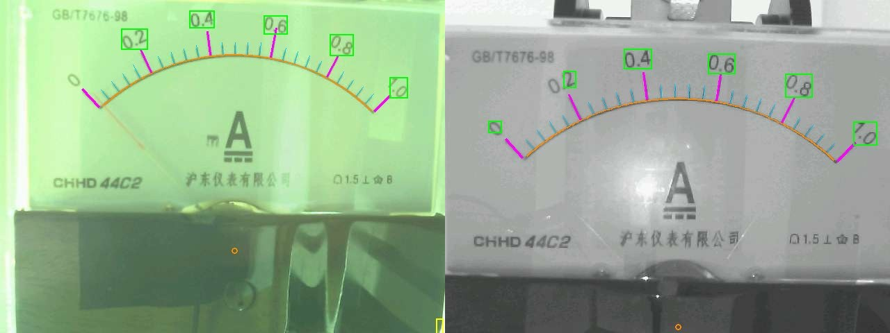

# Ein analoges Zeigerinstrument optisch auslesen — mit einem ESP32-S3 und seiner Kamera

Prof. Dr.-Ing. Ralph Wystup M.Sc. — erstellt mit KI und Agent (Claude Code, Anthropic)

**Seite öffnen:** https://ralphwystup.github.io/Analoganzeige-optisch-lesen-mit-ESP32-S3/ — das Verfahren im Browser: ein gezeichnetes Instrument, das die Erkennung der Firmware
(Skalenbogen, Teilstriche, Rotbild, Zeigergerade, Ablesung am Schnittpunkt) Zeile für Zeile liest, die Kurve über den
Messbereich, der Bildsatz vom Gerät mit der Ablesung der Firmware neben der Ablesung im Browser, und das Manuskript als
Dokumentation in der Seite. Läuft offline.

Ein Drehspulinstrument (44C2, 0–1 mA) wird von einem Freenove ESP32-S3 mit Kameramodul vollständig auf dem Board gelesen:
Belichtung als Messung, Skala in jedem Bild neu (Bogen, 26 Teilstriche, 6 Hauptstriche, Ziffernkästen), Zeiger als Gerade
ohne Kenntnis des Drehpunkts, Ablesung am Schnittpunkt mit dem Bogen — nur der Messbereich vom Typenschild wird gebraucht.
Der Wert steht als Modbus-TCP-Register für eine Leitwarte bereit. Offline am Bildsatz: größte Abweichung 0,011 mA.

**Manuskript:** [`MANUSKRIPT_Analoganzeige.pdf`](MANUSKRIPT_Analoganzeige.pdf) — 27 Seiten: Aufgabe, Aufbau, Verfahren Schritt
für Schritt, Ergebnisse am Gerät, Anbindung an die Leitwarte, Betrieb und Absicherung, der Weg über Version 1, Lehren, Ausblick.

## Was drin ist

| Datei | Inhalt |
|:--|:--|
| [`Analoganzeige_lesen_1.0.html`](Analoganzeige_lesen_1.0.html) | Simulation (gezeichnetes Instrument, Kurve 0 … 1 mA), Nachweis am Bildsatz, Dokumentation |
| [`MANUSKRIPT_Analoganzeige.pdf`](MANUSKRIPT_Analoganzeige.pdf) / [`.docx`](MANUSKRIPT_Analoganzeige.docx) / [`.md`](MANUSKRIPT_Analoganzeige.md) | das Manuskript |
| [`LIESMICH_Inbetriebnahme.md`](LIESMICH_Inbetriebnahme.md) | Inbetriebnahme, Bedienung, Registerplan Modbus TCP |
| [`PRUEFPLAN_Seite.md`](PRUEFPLAN_Seite.md) | Prüfplan der Seite: JavaScript-Erkennung gegen Prüfstrom und Firmware, Browserprüfung |
| `firmware/` | Firmware Version 2 für den ESP32-S3 (Arduino, zehn Dateien, `sketch.yaml` für arduino-cli); Netzzugang in `ESP32S3_Zeiger_V2.ino` eintragen |
| `pc/` | Offline-Referenz der Erkennung (`skala_v2.py`, `zeiger_v2.py`, `zeiger_lesen.py`), Kurve mit Prüfstrom (`kurve_v2.py`), Belichtungsraster, Modbus-Prüfung, Bildsatz aufnehmen, Baugate (`firmware_bauen.py`) |
| `bildsatz/` | zehn Aufnahmen des Geräts 0 … 0,85 mA mit dem Status-JSON der Firmware je Bild |
| `seite/` | Erzeuger der Seite, die Erkennung in JavaScript, Prüfmittel |
| `bilder/` | Bilder des Manuskripts |
| `index.html` | leitet auf die Seite weiter, damit GitHub Pages sie unter der Adresse oben zeigt |

## Nachrechnen

    cd pc
    python3 skala_v2.py ../bildsatz/0p50.jpg skala.jpg      # Bogen, Striche, Ziffern einzeichnen
    python3 zeiger_v2.py ../bildsatz 1.0 aus                 # Zeiger und Wert am ganzen Bildsatz
    cd ../seite && node pruefe_lesen.mjs                     # dieselbe Erkennung in JavaScript

Benötigt Python 3 mit numpy, scipy, Pillow; für die Seite Node.js (nur zum Prüfen). Die Firmware übersetzt mit arduino-cli
(esp32-Kern 3.3.x, Board ESP32S3 Dev Module, Einstellungen in `sketch.yaml`).

## Lizenz

MIT, siehe [LICENSE](LICENSE).
